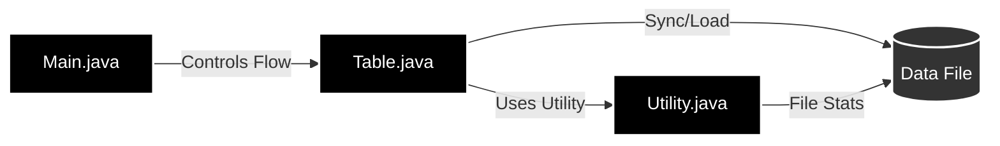

# <p align="center"></p>

<p align="center">
  
  
  
</p>

---

## 🚀 Overview

**csvSQL** is a high-performance Java database engine that bridges the gap between simple flat-file storage and robust relational database management. It enables dynamic schema evolution and full CRUD operations directly on CSV files, providing a lightweight yet powerful solution for localized data management and persistence.

## 📑 Table of Contents
- [Features](#-features)
- [Quick Start](#-quick-start)
- [Architecture](#-architecture)
- [API Reference](#-api-reference)
- [Usage Examples](#-usage-examples)
- [Roadmap](#-roadmap)
- [License](#-license)

---

## ✨ Features

- 🛠️ **Full CRUD Operations**: Create, Read, Update, and Delete records with ease.
- 📂 **Schema Evolution**: Dynamically add and drop columns without manual CSV editing.
- 💾 **File Persistence**: Automatic synchronization between memory and CSV files.
- 🔍 **Filtering & Selection**: SQL-like `select` methods with support for column/value filtering.
- 📊 **Beautiful CLI Display**: Built-in automatic table formatting for console visualization.
- ⚡ **Lightweight Utility**: Core helper methods optimized for array and file operations.

---

## 🏎️ Quick Start

Get csvSQL running in your terminal in under a minute:

1. **Clone & Build**:
   ```bash
   javac -d bin src/items/*.java src/main/*.java src/utility/*.java
   ```

2. **Run Demo**:
   ```bash
   java -cp bin main.Main
   ```

3. **Try the Code**:
   ```java
   Table myTable = new Table("employees.csv");
   myTable.setTableName("Engineering");
   myTable.addColumn("Role");
   myTable.insert("Alice", "BackEnd Developer", "Senior");
   myTable.display();
   ```

---

## 🏗️ Architecture

The system is designed for modularity and minimal dependencies.



---

## 📚 API Reference

### `Table` Class
The core data management unit.

| Method | Description | Complexity |
| :--- | :--- | :--- |
| `addColumn(String name)` | Adds a new column to the table. | O(n) |
| `dropColumn(String name)` | Removes a column and tilts data. | O(n²) |
| `insert(String... values)` | Appends a new record. | O(n) |
| `delete(String col, String val)` | Deletes records matching criteria. | O(n) |
| `update(String col, String val, String param, String newVal)` | Updates specific record fields. | O(n) |
| `select()` | Retrieves all data & displays it. | O(n) |
| `display()` | Formats and prints data to stdout. | O(n²) |

### `Utility` Class
Static helpers for low-level operations.
- `getRowCount(String file)`: Efficiently counts file lines.
- `copyArray2D(...)`: Fast cloning of multidimensional arrays.

---

## 💡 Usage Examples

### Dynamic Filtering
```java
// Select records where "Department" is "IT"
String[] filters = {"Department"};
String[] values = {"IT"};
String[][] itStaff = myTable.select(filters, values);
```

### Table Representation
csvSQL automatically handles column alignment for you:
```text
---------------------------------
| Name   | Role             |
---------------------------------
| Alice  | Senior Developer |
---------------------------------
```

---

## 🗺️ Roadmap

- [ ] **SQL Query Parser**: Support for raw string queries (e.g., `SELECT * FROM table WHERE ...`).
- [ ] **Data Typing**: Implement type validation (Integer, Double, Date).
- [ ] **Indexing**: Add primary key indexing for O(1) searches.
- [ ] **Export Options**: Support for JSON and XML exports.

---

## ⚖️ License

Distributed under the MIT License. See `LICENSE` for more information.

---

<p align="center">Made with ❤️ by Ali Fuat Akyemis</p>
